> # **REST API BERBASIS LARAVEL PROJEK APLIKASI ANDROID KULINER KHAS MADIUN**
---
	CONTENT :  
*	[Mata Kuliah](#mata-kuliah)
*	[Cara Installasi Di Lokal](#cara-installasi-di-lokal)
*	[Menjalankan Server Lokal Laravel](#menjalankan-server-lokal-laravel)
*	[HTTP Request API](#http-request-api)
---
## **Mata Kuliah**
> PENGEMBANGAN APLIKASI _MOBILE_
---
* ## **Cara Installasi Di Lokal**

	1.	Buka **XAMPP Control Panel**, lalu nyalakan **Apache** dan **MySQL**

		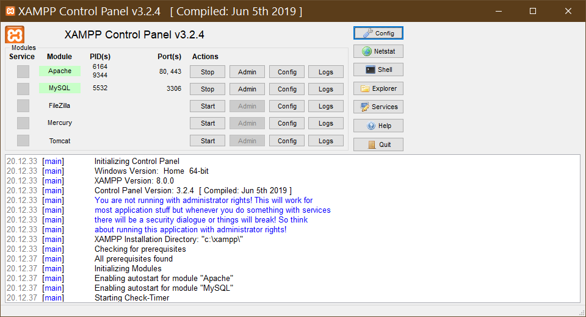 

	2. Buat **Database MySQL** melalui **PhpMyAdmin** dengan nama database sesuai keinginan Anda.

		**Note** :  
		Ubah kolom penyortiran menjadi `utf8_unicode_ci`.  
		Pembuatan tabel akan dilakukan nanti.

		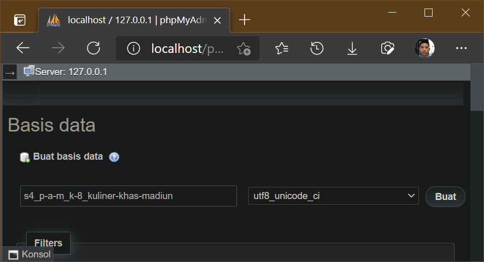  

	3.	Buka **Explorer**, lalu buat folder baru sebagai tempat projek dengan lokasi dan nama folder sesuai keinginan anda.

		**Note** :  
		Folder projek tidak harus di htdocs XAMPP, karena Laravel mempunyai server lokal sendiri

		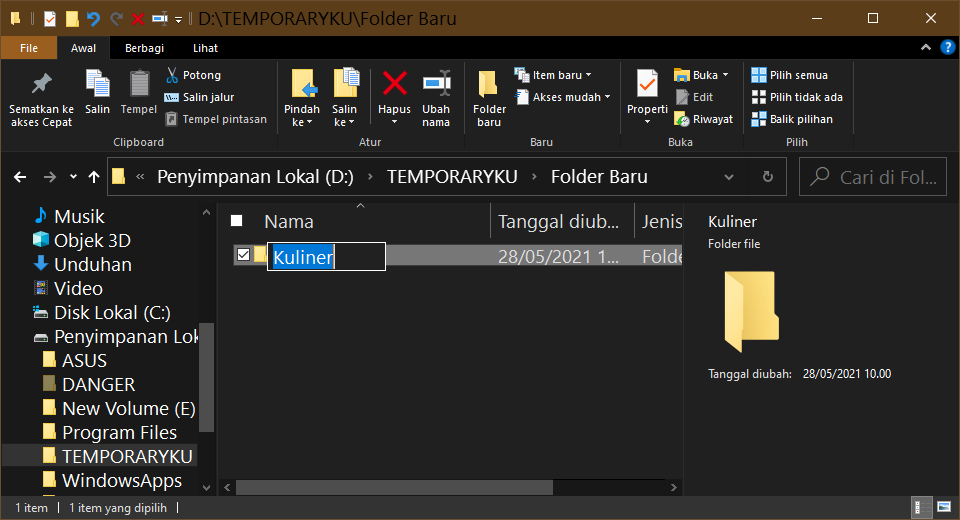 

	4.	Masuk ke dalam folder tersebut.

		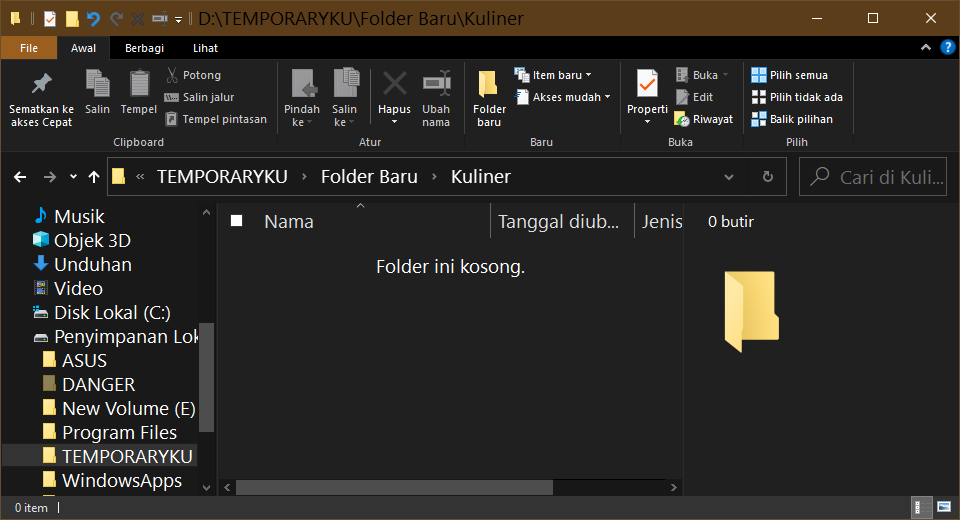 

	5.	Klik kanan di dalam folder tersebut, lalu klik `Git Bash Here`.  

		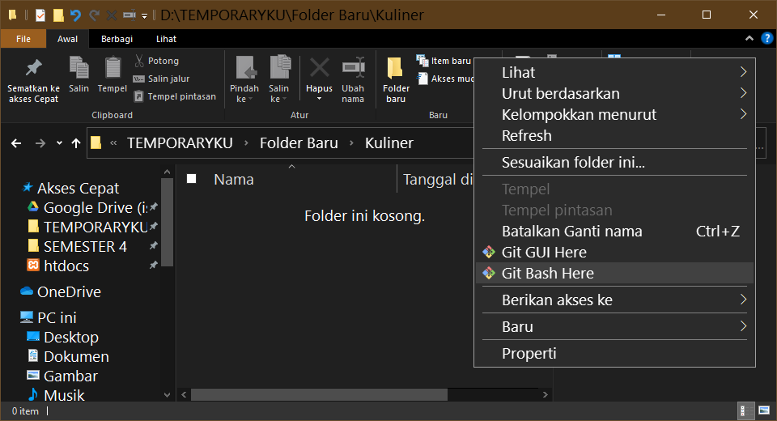

	6.	Di **Git Bash**, Lakukan perintah berikut untuk meng-_clone_ repositori ini :  
		`git clone https://github.com/isnandar1471/kuliner-khas-madiun.git`  
		Lalu klik Enter.

		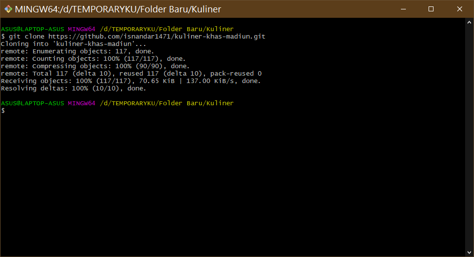  
		Maka repositori ini telah di _clone_ ke dalam folder kosong tadi

	7.	Buka folder `kuliner-khas-madiun`. Lalu, **duplikat** file `.env.example`. Tempatkan file duplikat tadi di folder yang sama.

	8.	Ganti nama file duplikat menjadi `.env`  
	Lalu buka file tersebut.

	9.	Edit file `.env`, pada bagian berikut :

		```properties
		DB_CONNECTION = mysql
		DB_HOST       = 127.0.0.1
		DB_PORT       = 3306
		DB_DATABASE   = s4_p-a-m_k-8_kuliner-khas-madiun
		DB_USERNAME   = root
		DB_PASSWORD   = 
		```

		Edit baris `DB_DATABASE` , `DB_USERNAME` dan `DB_PASSWORD`  
		Sesuaikan baris tersebut sesuai dengan MySQL Anda. 

	10.	Buka folder `config`, lalu edit file `database.php`.
		Edit bagian `'connections'` => `'mysql'`, pada baris `'charset'` , `'collation'` , & `'engine'` menjadi seperti berikut :

		```properties
			'charset' => 'utf8',

			'collation' => 'utf8_unicode_ci',
			
			'engine' => 'InnoDB',
		```


	11.	Kembali ke Git Bash, masuk ke dalam folder `kuliner-khas-madiun` dengan cara ketikkan perintah berikut :  
		`cd kuliner-khas-madiun`  
		Lalu klik Enter.

		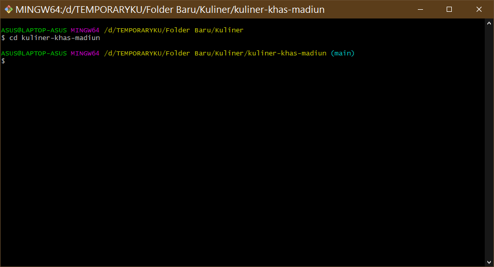 

	12.	Lakukan perintah berikut untuk men-`install` laravel :  
		`composer install`  
		Lalu klik Enter.

		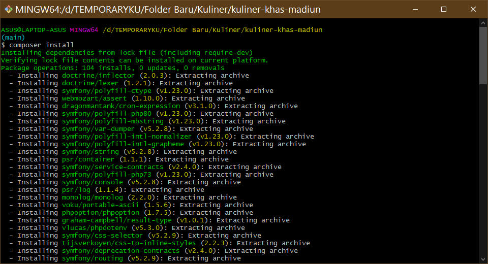 

	13.	Lakukan perintah berikut untuk men-`generate` KEY :  
		`php artisan key:generate`  
		Lalu klik Enter.

		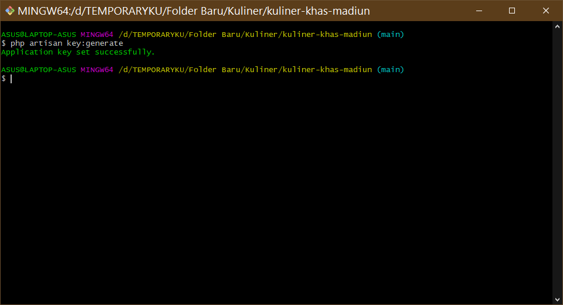 

	13.	Lakukan perintah berikut untuk membuat tabel dengan migration yang telah dibuat:  
		`php artisan migrate`

		Maka tabel akan dibuat secara otomatis.

		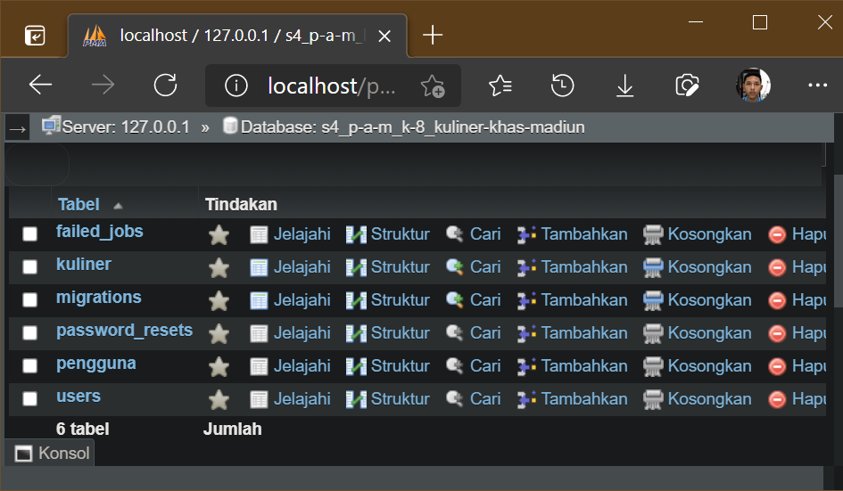 

---
* ## **Menjalankan Server Lokal Laravel**

	1.	Lakukan perintah berikut untuk menjalankan server lokal milik Laravel :  
		`php artisan serve`

		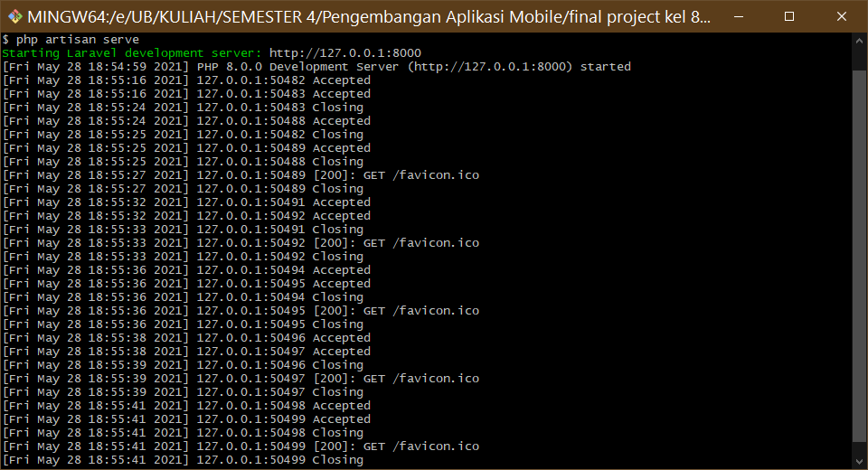 

---
* ## **HTTP Request API**

	Terdapat 6 tabel di dalam database :
	*	`failed_jobs`
	*	`kuliner`
	*	`migrations`
	*	`password_resets`
	*	`pengguna`
	*	`users`

	Namun, tabel yang digunakan dalam API ini hanya tabel :
	*	`kuliner`
	*	`pengguna`

	Tabel lainnya dapat dihiraukan karena merupakan tabel bawaan jika kita menggunakan `migration` Laravel.

	Berikut langkah - langkah HTTP Request API yang dapat dilakukan : 
	1.	Buka **Postman**
	2.	Buat Request Baru
	3.	Isi kolom-kolom sesuai keinginan seperti tabel berikut :
		| Permintaan                | Method   | URL                                      |
		| ------------------------- | -------- | ---------------------------------------- |
		| Mendapat semua baris data | `GET`    | `http://127.0.0.1:8000/api/{tabel}`      |
		| Mendapat 1 baris data     | `GET`    | `http://127.0.0.1:8000/api/{tabel}/{id}` |
		| Menambah 1 baris data     | `POST`   | `http://127.0.0.1:8000/api/{tabel}/{id}` |
		| Mengubah 1 baris data     | `PATCH`  | `http://127.0.0.1:8000/api/{tabel}/{id}` |
		| Menghapus 1 baris data    | `DELETE` | `http://127.0.0.1:8000/api/{tabel}/{id}` |
		|

		**Note** :  
		Sesuaikan `{tabel}` dengan tabel yang dapat digunakan  
		Sesuaikan `{id}` dengan id data yang diinginkan 